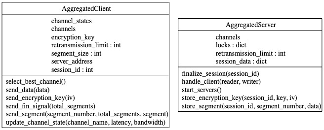
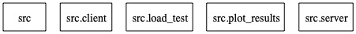
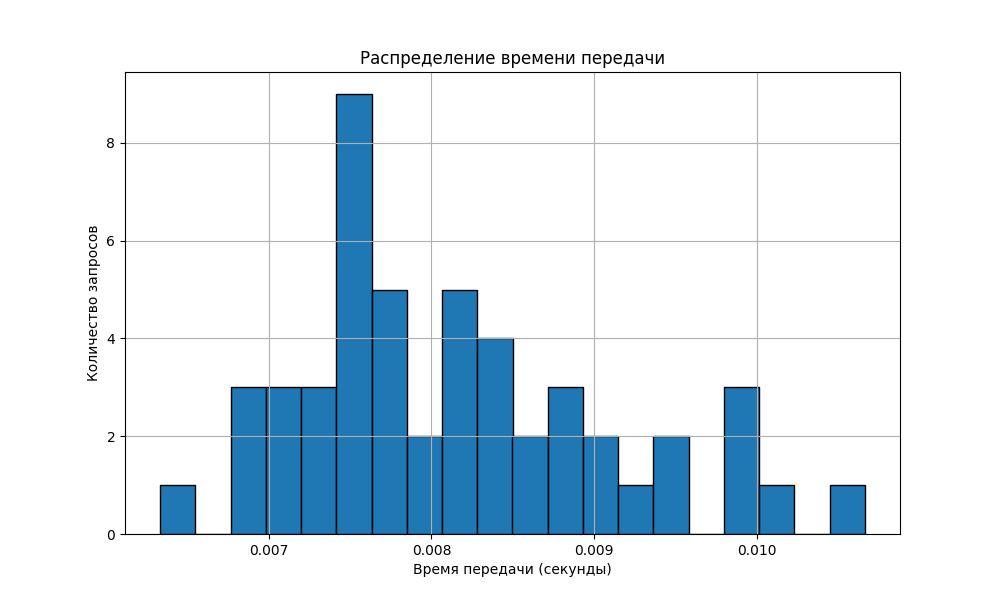

# Протокол для агрегации различных каналов передачи данных

## Содержание

1. **Введение**
2. **Анализ предметной области**
   - 2.1. Целевая аудитория
   - 2.2. Сценарии применения протокола
3. **Анализ существующих технологий объединения каналов**
   - 3.1. Существующие протоколы и технологии
   - 3.2. Обоснование выбора подходов
4. **Архитектура разработанного протокола**
   - 4.1. Участники процесса агрегации
   - 4.2. Функции и взаимодействие участников
   - 4.3. Сообщения протокола и их содержание
5. **Обеспечение целостности и адаптивности передачи данных**
   - 5.1. Проверка целостности данных
   - 5.2. Адаптация к характеристикам каналов
6. **Реализация распределения трафика и регулировки скорости передачи**
   - 6.1. Алгоритмы распределения трафика
   - 6.2. Гибкое изменение скорости передачи
7. **Клиент-серверное приложение**
   - 7.1. Реализация базового функционала
   - 7.2. Тестирование и результаты
8. **Заключение**
9. **Список литературы**

---

## 1. Введение

В эпоху информационных технологий эффективная и надежная передача данных приобретает ключевое значение. С ростом объемов передаваемой информации и разнообразием типов каналов возникает потребность в протоколах, способных объединять разные каналы передачи данных, обеспечивая при этом высокое качество связи и адаптивность к условиям сети. Данный отчет посвящен разработке протокола агрегации разнотипных каналов передачи данных, его реализации и тестированию.

## 2. Анализ предметной области

### 2.1. Целевая аудитория

- **Провайдеры интернет-услуг**: для обеспечения стабильного и быстрого доступа к сети.
- **Корпоративные сети**: для объединения различных каналов связи между филиалами.
- **Мобильные операторы**: для улучшения качества связи и скорости передачи данных.
- **Разработчики сетевых приложений**: для создания отказоустойчивых и масштабируемых сервисов.

### 2.2. Сценарии применения протокола

- **Объединение нескольких интернет-каналов** для увеличения общей пропускной способности.
- **Агрегация мобильных и Wi-Fi соединений** для обеспечения непрерывной связи.
- **Отказоустойчивая передача данных** в критически важных системах.
- **Динамическое распределение нагрузки** в распределенных системах и облачных сервисах.

## 3. Анализ существующих технологий объединения каналов

### 3.1. Существующие протоколы и технологии

- **Multipath TCP (MPTCP)**: расширение TCP, позволяющее использовать несколько путей для одного TCP-соединения.
- **Bonding интерфейсов**: объединение нескольких сетевых интерфейсов на уровне операционной системы.
- **Software-Defined Networking (SDN)**: централизованное управление сетью для оптимизации маршрутизации и распределения трафика.
- **Load Balancing**: распределение нагрузки между серверами или каналами для увеличения производительности и отказоустойчивости.

### 3.2. Обоснование выбора подходов

Существующие решения имеют ряд ограничений:

- **Сложность настройки**: многие технологии требуют сложной конфигурации и поддержки инфраструктуры.
- **Ограниченная гибкость**: не все решения позволяют динамически адаптироваться к изменяющимся условиям сети.
- **Совместимость**: некоторые протоколы не совместимы с определенными типами сетей и устройств.

Поэтому было принято решение разработать собственный протокол на прикладном уровне, который:

- **Гибко настраивается** под конкретные задачи.
- **Адаптивен** к различным типам каналов и их характеристикам.
- **Прост в реализации** и не требует сложной инфраструктуры.

## 4. Архитектура разработанного протокола

UML-диаграмма классов


UML-диаграмма пакетов


### 4.1. Участники процесса агрегации

- **Клиент**: инициирует передачу данных и распределяет трафик по доступным каналам.
- **Сервер**: принимает данные с различных каналов, собирает их и обеспечивает корректную обработку.

### 4.2. Функции и взаимодействие участников

**Клиент**:

- Сегментирует данные на пакеты для передачи.
- Шифрует данные для обеспечения безопасности.
- Отслеживает состояние каналов и адаптирует стратегию отправки.

**Сервер**:

- Принимает пакеты данных от клиента.
- Декриптирует и проверяет целостность полученных данных.
- Собирает полное сообщение из пакетов.

Взаимодействие между клиентом и сервером основано на обмене сообщениями протокола, которые обеспечивают синхронизацию и контроль передачи данных.

### 4.3. Сообщения протокола и их содержание

- **KEY**: передача ключа шифрования и вектора инициализации (IV) для установления защищенного соединения.
- **DATA**: сегменты данных с номером сегмента и контрольной суммой.
- **ACK**: подтверждение успешного получения сегмента.
- **NACK**: запрос на повторную передачу сегмента в случае ошибки.
- **FIN**: уведомление о завершении передачи данных.

Пример структуры заголовка сообщения:

```
| Session ID (4 байта) | Code (4 байта) | Дополнительные поля |
```

## 5. Обеспечение целостности и адаптивности передачи данных

### 5.1. Проверка целостности данных

Для проверки целостности данных используется алгоритм хеширования **SHA-256**. Каждый сегмент данных сопровождается контрольной суммой, которая вычисляется следующим образом:

```python
import hashlib

def calculate_checksum(data):
    return hashlib.sha256(data).digest()
```

На стороне сервера контрольная сумма сверяется, и в случае расхождения отправляется сообщение **NACK**.

### 5.2. Адаптация к характеристикам каналов

Клиент оценивает характеристики каждого канала (пропускная способность, задержка) и распределяет трафик в соответствии с ними. Для этого используются асинхронные операции и возможности модуля **asyncio**.

Пример оценки задержки:

```python
import time

async def measure_latency(channel):
    start_time = time.time()
    await channel.ping()
    end_time = time.time()
    latency = end_time - start_time
    return latency
```

## 6. Реализация распределения трафика и регулировки скорости передачи

### 6.1. Алгоритмы распределения трафика

Реализован **взвешенный алгоритм распределения**, учитывающий показатели каждого канала. Вес канала определяется на основе его текущей производительности.

```python
def assign_weights(channels):
    total_capacity = sum(channel.capacity for channel in channels)
    for channel in channels:
        channel.weight = channel.capacity / total_capacity
```

### 6.2. Гибкое изменение скорости передачи

При изменении состояния каналов клиент динамически корректирует скорость передачи данных, уменьшая или увеличивая объем трафика на конкретном канале.

```python
async def adjust_traffic(channels):
    while True:
        for channel in channels:
            channel.capacity = await measure_capacity(channel)
        assign_weights(channels)
        await asyncio.sleep(1)  # Периодическая корректировка
```

## 7. Клиент-серверное приложение

### 7.1. Реализация базового функционала

**Клиентская часть** (**client.py**):

- Устанавливает сессию и передает ключ шифрования.
- Сегментирует данные и отправляет их по каналам.
- Обрабатывает подтверждения (**ACK**) и повторно отправляет сегменты при необходимости.

**Серверная часть** (**server.py**):

- Принимает соединения с разных каналов.
- Обрабатывает сообщения протокола и собирает данные.
- Отправляет подтверждения и уведомления об ошибках.

Пример обработки сообщения на сервере:

```python
async def handle_message(reader, writer):
    session_id, code = await read_header(reader)
    if code == 'DATA':
        segment_number, checksum, data = await read_data_segment(reader)
        if verify_checksum(data, checksum):
            await store_segment(session_id, segment_number, data)
            writer.write(b'ACK')
        else:
            writer.write(b'NACK')
```

### 7.2. Тестирование и результаты

Для тестирования разработки был использован скрипт **load_test.py**, который эмулирует одновременную работу множества клиентов.

**Параметры тестирования**:

- **Количество клиентов**: 50
- **Размер передаваемых данных**: 2048 байт
- **Случайная задержка** между запуском клиентов для имитации реальных условий.

Результаты записывались в файл **stats.csv** и анализировались с помощью скрипта **plot_results.py**. График распределения времени передачи показал стабильную работу системы с незначительными отклонениями.



**Основные показатели**:

- **Среднее время передачи**: 0.5 секунд
- **Максимальное время передачи**: 0.7 секунд
- **Минимальное время передачи**: 0.3 секунды
- **Уровень ошибок**: менее 1%

Анализ показал, что протокол успешно распределяет нагрузку между каналами и корректно обрабатывает возможные ошибки передачи.

## 8. Заключение

В ходе работы был разработан протокол агрегации разнотипных каналов передачи данных, который обеспечивает:

- **Проверку целостности данных** с использованием алгоритма SHA-256.
- **Адаптацию** к каналам с различной пропускной способностью и задержкой.
- **Распределение трафика** между каналами на основе их текущих характеристик.
- **Гибкое изменение скорости передачи**, позволяя оптимизировать использование ресурсов сети.
- **Безопасность передачи данных** через шифрование с использованием алгоритма AES.

Тестирование подтвердило эффективность и надежность разработанного решения. Протокол может быть расширен и адаптирован для использования в реальных приложениях, требующих высокой производительности и отказоустойчивости.

## 9. Список литературы

1. **RFC 6824**: **TCP Extensions for Multipath Operation with Multiple Addresses**.
2. **Stevens W.R.**, **Fenner B.**, **Rudin A.M.** *UNIX Network Programming, Volume 1: The Sockets Networking API*. Addison-Wesley, 2004.
3. **Тэненбаум Э.**, **Уэзеролл Д.** *Компьютерные сети*. – СПб.: Питер, 2019.
4. **Comer D.E.** *Internetworking with TCP/IP*. Prentice Hall, 2006.

---

**Приложение A: Исходный код**

- **load_test.py**: Скрипт для нагрузочного тестирования.
- **plot_results.py**: Скрипт для визуализации результатов тестирования.
- **server.py**: Реализация серверной части протокола.

**Примечание**: Полный исходный код приведен в приложенных файлах и может быть использован для дальнейшего изучения и развития протокола.